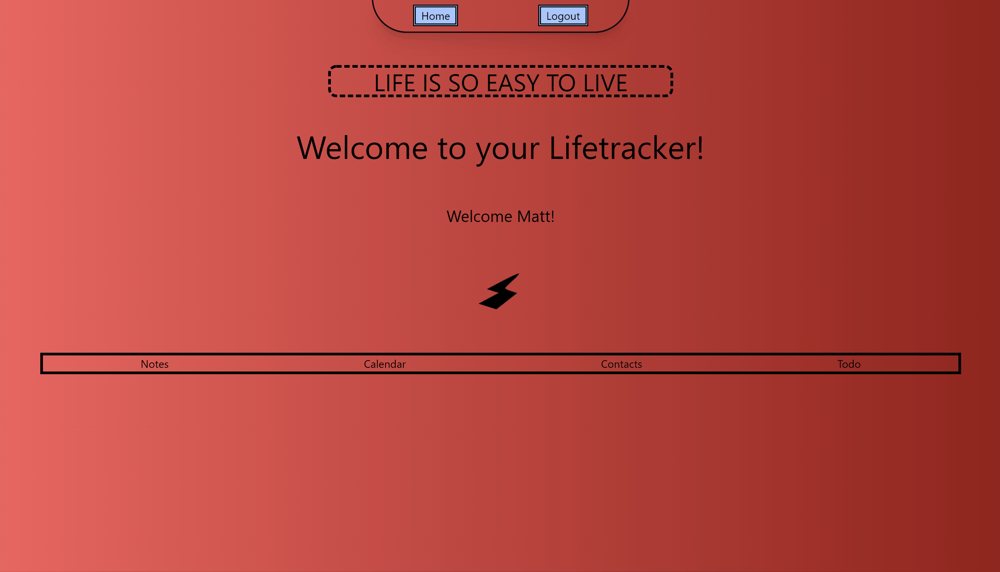

# Project 2 **Lifetracker**

## Description

This is application was built in mind for the everyday person, meant to provide structure and aid to a busy schdule everyone can relate to. The application comes fully equipped with Notes, ToDo, Calendar, and Contacts features. This project utilizes Full-stack code, including storing the users profile to login and certain contacts and information on a database to be called from predesigned routes.  

## Languages
- Handlebars
- Node.js
- Tailwind (styling)
- Express.js
- npm Modules

## Link to GitHub project page

[Portfolio Project Page on GitHub](https://github.com/m-sherrill/Project-2)

## Link to Deployed Application

[Live Deployment Link](https://lifetracker-project2.herokuapp.com/)

## Visuals of Finished Product

## Contact Information

Github: 
- [Maykanwara](https://github.com/Maykanwara/Project-2)
- [m-sherrill](https://github.com/m-sherrill)
- [JonkHunkle](https://github.com/JonkHunkle)
- [FatimaFBZ](https://github.com/FatimaFBZ)
- [Matthewwalker333](https://github.com/Matthewwalker333)

Email: 
- Kanwara Moore *maykanwara@gmail.com*
- Morgan Sherrill *mo.sherrill@outlook.com*
- David Czerwinski *dczerwinski@ymail.com*
- Fatima Baluch *fatima_baluch@hotmail.com*
- Matthew Walker *matthewwalkermw64@gmail.com*
